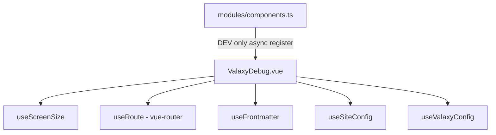
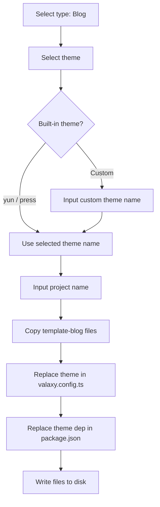

## Product Overview

为 Valaxy 框架实现两个功能改进：(1) 创建通用的 ValaxyDebug 调试组件，替代当前仅存在于 yun 主题中的简易调试面板；(2) 为 create-valaxy 脚手架工具增加主题选择功能。

## Core Features

### ValaxyDebug 通用调试组件

- 仅在开发模式下渲染的全局调试面板，固定定位在页面左下角
- 显示响应式断点状态（xs/sm/md/lg/xl/2xl），复用已有 useScreenSize composable
- 显示当前路由信息（路径、路由名称、query、params、layout）
- 显示当前页面 frontmatter 摘要信息
- 显示 Valaxy 配置概览（当前主题名、站点基本信息）
- 支持分组折叠/展开各调试面板区域，支持整体关闭
- 作为 Valaxy 核心组件全局注册，所有主题均可直接使用

### create-valaxy 主题选择

- 在选择 Blog 类型后，新增主题选择交互步骤
- 提供内置主题列表供选择（yun 为默认选项、press 等官方主题）
- 支持用户选择 "Custom" 选项后输入自定义主题名（如 valaxy-theme-xxx 或短名 xxx）
- 选择主题后，动态修改生成项目的 valaxy.config.ts 中的 theme 字段和 import 语句，以及 package.json 中的主题依赖
- 使用 -y 快速参数时默认使用 yun 主题，保持向后兼容

## Tech Stack

- Vue 3 + TypeScript + `<script setup>` (Composition API)
- Pinia (stores)
- VueUse (`useMediaQuery`)
- UnoCSS (utility classes，与 YunDebug.vue 风格一致)
- Node.js + prompts 库 (CLI 交互，复用现有依赖)
- consola/utils colors (终端着色)

## Implementation Approach

### ValaxyDebug 组件

**策略**：在 `packages/valaxy/client/components/` 下创建 `ValaxyDebug.vue`，复用现有的 `useScreenSize`、`useFrontmatter`、`useSiteConfig`、`useValaxyConfig` 等 composable，通过 `modules/components.ts` 仅在 DEV 模式下全局注册。

**关键技术决策**：

1. **DEV-only 零成本**：使用 `import.meta.env.DEV` 作为注册条件，Vite 在生产构建时会 tree-shake 移除整个组件及其依赖，确保对生产环境零影响。在 `modules/components.ts` 中通过条件 import + 条件注册实现。
2. **复用已有 composables**：`useScreenSize()`（断点）、`useFrontmatter()`（frontmatter）、`useSiteConfig()`（站点配置）、`useValaxyConfig()`（完整配置）、`useRoute()`（路由）——全部已存在于 valaxy 核心包中，无需引入任何新依赖。
3. **面板式交互**：组件采用固定定位 + 高 z-index，参考 `YunDebug.vue` 的交互模式。内部分多个可折叠区域（Breakpoints、Route、Frontmatter、Config），使用 `ref` 管理各区域的展开/折叠状态。外层有一个总开关控制整个面板的显示/隐藏。
4. **JSON 数据展示**：frontmatter 和 config 等对象型数据使用 `JSON.stringify(data, null, 2)` 格式化显示，包裹在 `<pre>` 中，保持简洁可读。

### create-valaxy 主题选择

**策略**：在 Blog 模板的初始化流程中，于选择类型（Blog）后、输入项目名前，插入一个主题选择 prompt。在写入模板文件阶段，根据用户选择的主题动态替换 `valaxy.config.ts` 和 `package.json` 中的主题相关内容。

**关键技术决策**：

1. **BLOG_THEMES 常量**：在 `config.ts` 中新增 `BLOG_THEMES` 数组，定义内置主题选项（yun/press）及一个 "Custom" 选项。每个主题项包含 `name`、`display`、`color`、`desc` 字段，风格与现有 `TEMPLATES` 一致。
2. **Prompt 流程**：使用现有的 `prompts` 库（保持一致性）。先展示 select 列表让用户选择主题；如果选择 "Custom"，则追加一个 text prompt 让用户输入自定义主题名（支持短名如 `starter` 或完整包名 `valaxy-theme-starter`）。
3. **模板替换**：在模板文件写入磁盘后，读取 `valaxy.config.ts` 和 `package.json` 的内容，使用精确字符串替换：

- `valaxy.config.ts`：替换 `valaxy-theme-yun`（import 中）为 `valaxy-theme-{theme}`，替换 `theme: 'yun'` 为 `theme: '{theme}'`，替换 `UserThemeConfig` 为通用类型
- `package.json`：替换依赖键 `valaxy-theme-yun` 为 `valaxy-theme-{theme}`（版本使用 `latest`，因为非 yun 主题无法使用 monorepo 版本）

4. **向后兼容**：`-y` 参数和无交互模式下跳过主题选择，默认使用 yun，不破坏现有行为

## Implementation Notes

1. **ValaxyDebug 注册方式**：在 `registerGlobalComponents` 中使用如下模式：

```ts
if (import.meta.env.DEV) {
  const ValaxyDebug = defineAsyncComponent(() => import('../components/ValaxyDebug.vue'))
  ctx.app.component('ValaxyDebug', ValaxyDebug)
}
```

使用 `defineAsyncComponent` + 动态 `import()` 确保生产构建时完全不会打包该组件代码。

2. **ValaxyDebug 性能**：调试面板中的路由/配置数据全部使用 `computed` 惰性计算。折叠状态下使用 `v-if` 不渲染详细内容。frontmatter/config 对象较大时，仅展示关键字段摘要。

3. **模板替换安全性**：

- `valaxy.config.ts` 替换时需同时处理 import 行中的类型引用（非 yun 主题改为通用写法）
- 替换使用 `String.replace()` 精确匹配，避免误替换
- 非 yun 主题的 `themeConfig` 内容清空为基础配置，避免引用不存在的类型

4. **向后兼容保障**：`-y` 参数和默认行为完全保留原有逻辑。主题选择 prompt 仅在非 `-y` 模式 + blog 类型时触发。

## Architecture Design

### ValaxyDebug 组件架构



组件通过全局注册后，任意主题布局或用户 App.vue 中均可直接使用 `<ValaxyDebug />`。由于是 DEV-only 注册，生产构建不包含任何相关代码。

### create-valaxy 主题选择流程



## Directory Structure

```
packages/valaxy/client/
├── components/
│   └── ValaxyDebug.vue          # [NEW] 通用调试组件。DEV 模式下显示多维调试面板：
│                                 #   1) 断点状态面板 - 复用 useScreenSize，展示 xs~2xl 状态
│                                 #   2) 路由面板 - useRoute 获取 path/name/query/params/layout
│                                 #   3) Frontmatter 面板 - useFrontmatter 获取当前页面元数据
│                                 #   4) 配置面板 - useSiteConfig/useValaxyConfig 展示主题名、站点信息
│                                 #   固定定位左下角，z-index 9999，深色半透明背景，支持折叠/关闭
├── modules/
│   └── components.ts            # [MODIFY] 在 registerGlobalComponents 中添加 ValaxyDebug 的
│                                 #   DEV 模式条件注册（defineAsyncComponent + dynamic import）

packages/create-valaxy/
├── src/
│   ├── config.ts                # [MODIFY] 新增 BLOG_THEMES 常量数组，定义内置主题选项：
│                                 #   - yun（默认）、press、Custom（自定义输入）
│                                 #   每项含 name/display/color/desc 字段，与 TEMPLATES 风格一致
│   └── valaxy.ts                # [MODIFY] Blog 流程改造：
│                                 #   1) 选择 Blog 后插入主题选择 prompt（select + custom text）
│                                 #   2) 模板文件写入后，根据选中主题替换 valaxy.config.ts 内容
│                                 #      （theme 字段 + import 语句 + themeConfig）
│                                 #   3) 替换 package.json 中的主题依赖名和版本
│                                 #   4) -y 模式下跳过选择，默认 yun

docs/pages/zh/dev/
└── index.md                     # [MODIFY] 更新 TODO 列表，标记两项为已完成
```

## Agent Extensions

### Skill

- **vue-best-practices**
- Purpose: 确保 ValaxyDebug.vue 组件遵循 Vue 3 Composition API 最佳实践
- Expected outcome: 组件使用 `<script setup>` + TypeScript，正确使用 computed/ref，遵循 Vue 3 组件编写规范

- **vue**
- Purpose: 利用 Vue 3 SFC、Composition API、defineAsyncComponent 等特性编写调试组件
- Expected outcome: 正确使用 Vue 3 响应式系统、组件注册、条件渲染等功能

- **unocss**
- Purpose: ValaxyDebug 组件使用 UnoCSS 原子化 CSS 进行样式编写，与项目现有风格一致
- Expected outcome: 使用 UnoCSS utility classes 实现固定定位、背景色、圆角、间距等样式

- **pinia**
- Purpose: ValaxyDebug 组件中可能需要访问 Pinia store 的数据（如 useAppStore）
- Expected outcome: 正确读取 store 中的响应式状态用于调试面板展示

### SubAgent

- **code-explorer**
- Purpose: 在实现过程中如需探索更多代码上下文（如确认 composable 返回类型、检查依赖关系），使用 code-explorer 进行深度代码搜索
- Expected outcome: 准确获取实现所需的代码上下文，避免猜测
