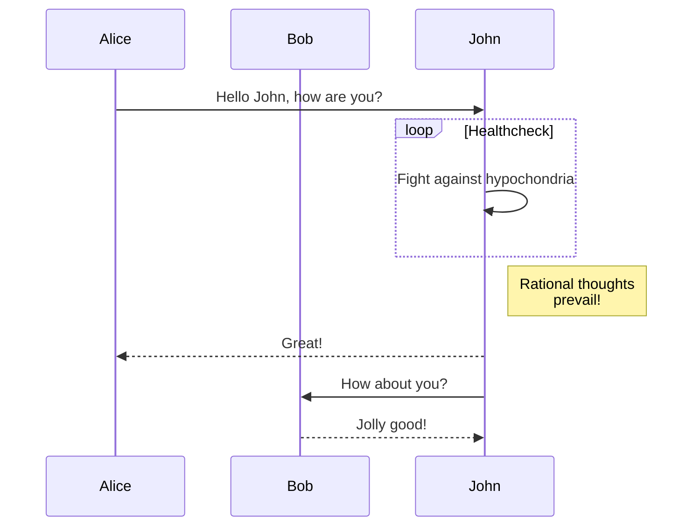
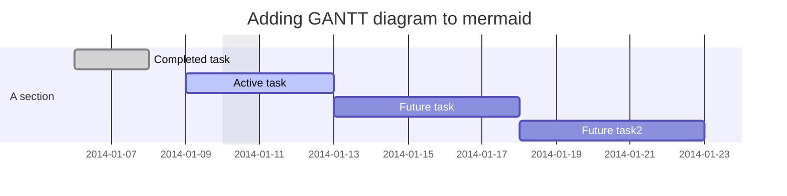
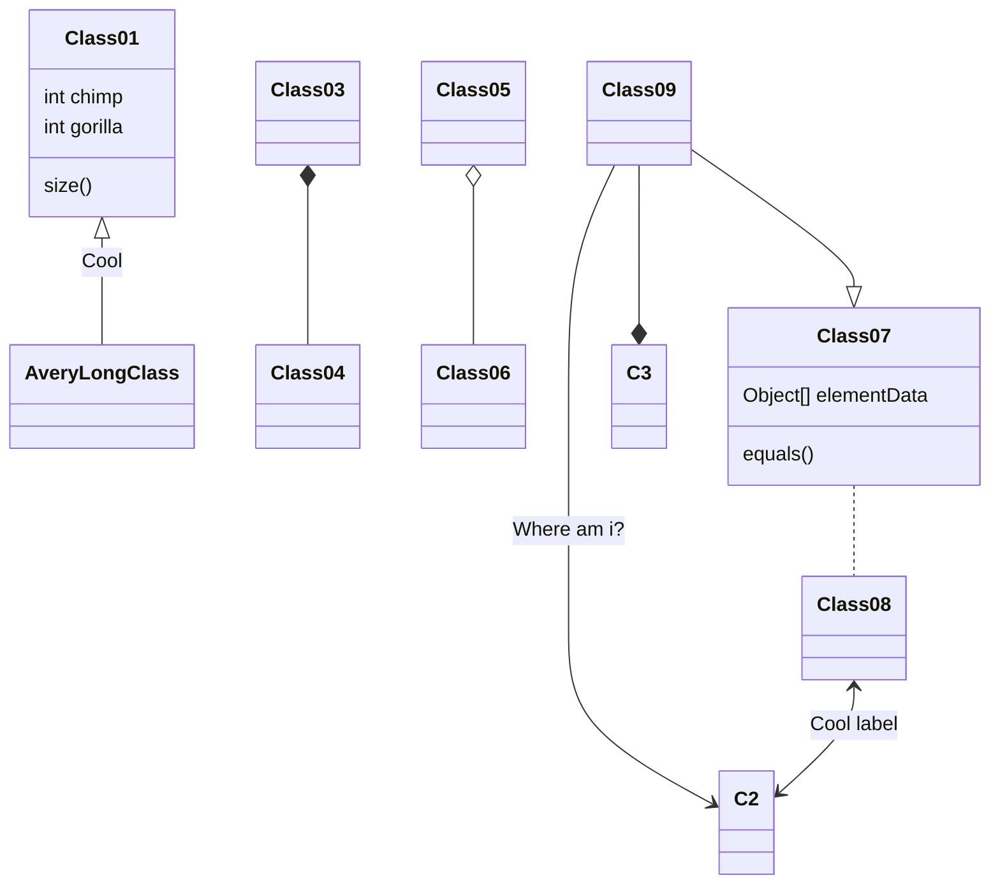
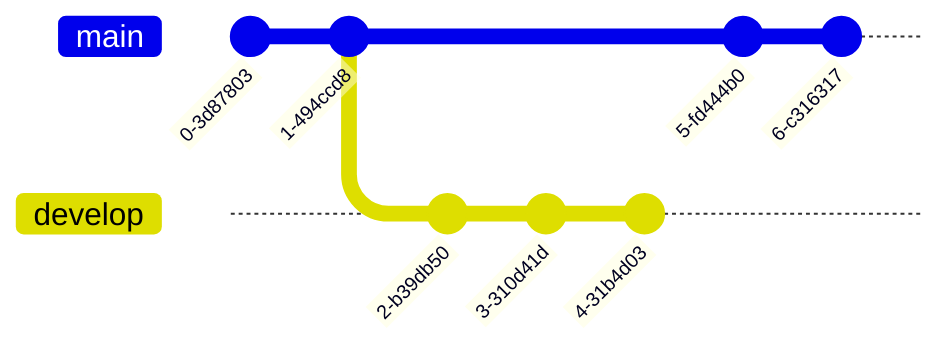
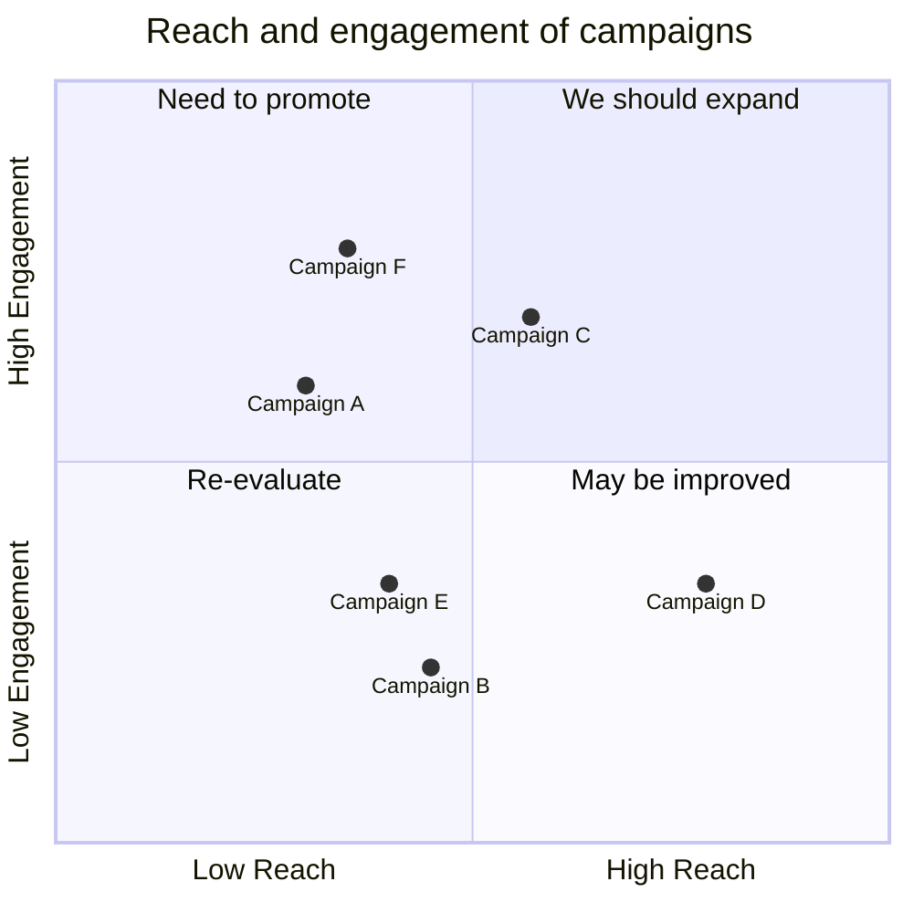
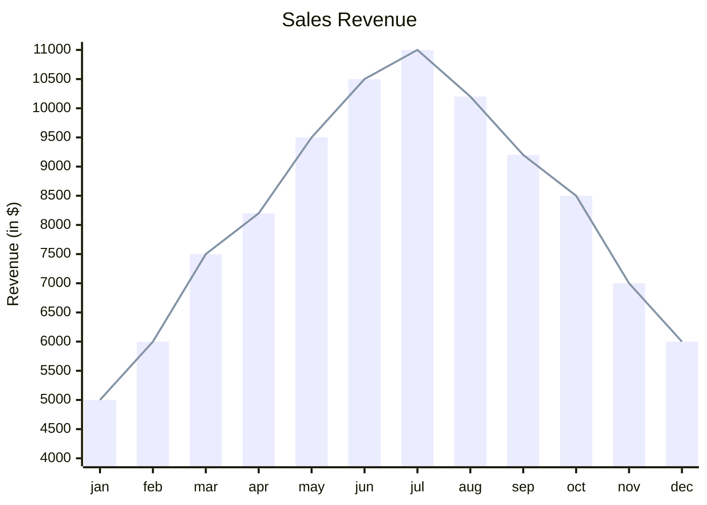

- [Mermaid](https://mermaid.js.org/) - Diagramming and charting tool

## Flowchart


````txt

````

## Sequence diagram



````txt

````

## Gantt diagram



````txt

````

## Class diagram



````txt

````

## Git graph



````txt

````

## Quadrant Chart



````txt

````

## XY Chart



````txt

````
