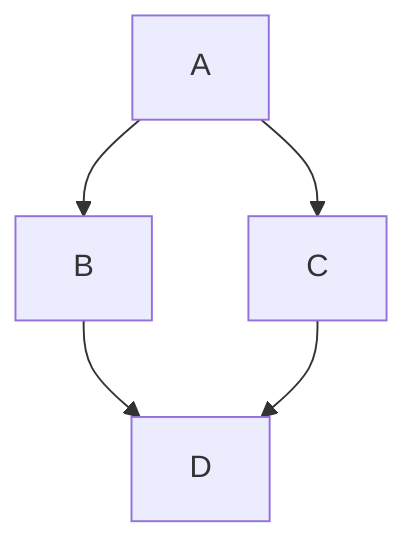

::: info
Unlike `Hexo`, `Valaxy` implements some Markdown extensions (such as Container, math formulas) at the framework level, without requiring theme developers to implement them again.

This is similar to many features of `VitePress`. `Valaxy` has borrowed a lot from `VitePress` and reuses plugins from [mdit-vue](https://github.com/mdit-vue/mdit-vue).
However, there are some differences. Valaxy uses [KaTeX](https://katex.org/) by default (fast rendering speed), and also supports [MathJax](https://www.mathjax.org/) (aligned with VitePress, SVG output without external CSS/fonts).

> **Note**: Do not enable `features.katex` and `math` at the same time. They use different rendering engines, and enabling both may cause duplicate rendering or style conflicts. When `math` (MathJax) is enabled, `features.katex` will be automatically ignored.

```ts [valaxy.config.ts]
export default defineValaxyConfig({
  // KaTeX (enabled by default)
  features: { katex: true },

  // Or switch to MathJax (install first: pnpm add markdown-it-mathjax3)
  // math: true,
})
```

Of course, you can still add MarkdownIt plugins in Valaxy to implement more features.
:::

## Using Vue in Markdown

You can directly import and use Vue components in Markdown files.

For example, create a Vue component `CustomVueDemo.vue` in the `components` directory:

<<< @/components/CustomVueDemo.vue [components/CustomVueDemo.vue]

```md [pages/posts/xxx.md]
---
title: Using Vue in Markdown
---

<!-- Use it directly in markdown: -->
<CustomVueDemo />
```

## Emoji :tada:


**Input**


```md
:tada: :100:
```

**Output**


:tada: :100:
A [list of all emojis](https://github.com/markdown-it/markdown-it-emoji/blob/master/lib/data/full.mjs) is available.


## Table of Contents


**Input**


```md
[[toc]]
```

**Output**


[[toc]]

Rendering of the TOC can be configured using the `markdown.toc` option.


## Line of Code Highlighting


**Input**

````md
```js{4}
export default {
  data () {
    return {
      msg: 'Highlighted!'
    }
  }
}
```
````

**Output**


```js{4}
export default {
  data () {
    return {
      msg: 'Highlighted!'
    }
  }
}
```

**Input**


````md
```ts {1}
// line-numbers is disabled by default
const line2 = 'This is line 2'
const line3 = 'This is line 3'
```

```ts:line-numbers {1}
// line-numbers is enabled
const line2 = 'This is line 2'
const line3 = 'This is line 3'
```

```ts:line-numbers=2 {1}
// line-numbers is enabled and start from 2
const line3 = 'This is line 3'
const line4 = 'This is line 4'
```
````

**Output**


```ts {1}
// line-numbers is disabled by default
const line2 = 'This is line 2'
const line3 = 'This is line 3'
```

```ts:line-numbers {1}
// line-numbers is enabled
const line2 = 'This is line 2'
const line3 = 'This is line 3'
```

```ts:line-numbers=2 {1}
// line-numbers is enabled and start from 2
const line3 = 'This is line 3'
const line4 = 'This is line 4'
````

## Colored Diffs in Code Blocks


Adding the `// [!code --]` or `// [!code ++]` comments on a line will create a diff of that line, while keeping the colors of the codeblock.


**Input**


Note that only one space is needed after `!code`, there are two spaces here in case it is rendered.

````md
```js
export default {
  data () {
    return {
      msg: 'Removed' // [!!code --]
      msg: 'Added' // [!!code ++]
    }
  }
}
```
````

**Output**


```js
export default {
  data() {
    return {
      msg: 'Removed', // [!code --]
      msg: 'Added', // [!code ++]
    }
  }
}
```

## Errors and Warnings in Code Blocks


Adding the `// [!code warning]` or `// [!code error]` comments on a line will color it accordingly.


**Input**


Note that only one space is needed after `!code`, there are two spaces here in case it is rendered.


````md
```js
export default {
  data () {
    return {
      msg: 'Error', // [!!code error]
      msg: 'Warning' // [!!code warning]
    }
  }
}
```
````

**Output**


```js
export default {
  data() {
    return {
      msg: 'Error', // [!code error]
      msg: 'Warning' // [!code warning]
    }
  }
}
```

## Import Code Snippets


You can import code snippets from existing files via following syntax:


```md
<<< @/filepath
```

It also supports [line highlighting](#line-of-code-highlighting):


```md
<<< @/filepath{highlightLines}
```

**Input**


```md
<<< @/snippets/snippet.js{2}
```

**Code file**


<<< @/snippets/snippet.js

**Output**


<<< @/snippets/snippet.js

::: tip

The value of `@` corresponds to the source root. By default it's the blog root, unless `srcDir` is configured. Alternatively, you can also import from relative paths:


```md
<<< ../snippets/snippet.js
```

:::

You can also use a [VS Code region](https://code.visualstudio.com/docs/editor/codebasics#_folding) to only include the corresponding part of the code file. You can provide a custom region name after a `#` following the filepath:


**Input**


```md
<<< @/snippets/snippet-with-region.js#snippet{1}
```

**Code file**


<<< @/snippets/snippet-with-region.js

**Output**


<<< @/snippets/snippet-with-region.js#snippet{1}

You can also specify the language inside the braces (`{}`) like this:


```md
<<< @/snippets/snippet.cs{c#}

<!-- with line highlighting: -->

<<< @/snippets/snippet.cs{1,2,4-6 c#}

<!-- with line numbers: -->

<<< @/snippets/snippet.cs{1,2,4-6 c#:line-numbers}
```

This is helpful if source language cannot be inferred from your file extension.


## Container

By configuring `markdownIt`, you can set the text and icon (and its color) for
custom block.

::: tip

tip

:::

::: warning

warning

:::

::: danger

danger

:::

::: info

info

:::

```md

::: details Click to expand

Details Content

:::

```md
::: details Click to expand

Details Content

:::
```


You can also customize new container names.


```md
::: custom

I am a custom block.

:::
```

```ts [valaxy.config.ts]
import { defineValaxyConfig } from 'valaxy'

export default defineValaxyConfig({
  markdown: {
    blocks: {
      custom: {
        icon: 'i-ri:info-i',
        text: 'CUSTOM',
      },
    }
  }
})
```


## Add Code Block Title And Icons

::: tip

More code block icon examples can be found [here](/examples/code-block-icons).

:::

It is implemented based on [vitepress-plugin-group-icons](https://github.com/yuyinws/vitepress-plugin-group-icons), with some [built-in icons](https://vp.yuy1n.io/features.html#built-in-icons). You can customize more icons as follows.

```ts [valaxy.config.ts] {5-14}
import { defineValaxyConfig } from 'valaxy'
import { localIconLoader } from 'vitepress-plugin-group-icons'

export default defineValaxyConfig({
  groupIcons: {
    customIcon: {
      // valaxy: 'https://valaxy.site/favicon.svg',
      valaxy: localIconLoader(import.meta.url, './public/favicon.svg'),
      nodejs: 'vscode-icons:file-type-node',
      playwright: 'vscode-icons:file-type-playwright',
      typedoc: 'vscode-icons:file-type-typedoc',
      eslint: 'vscode-icons:file-type-eslint',
      dockerfile: 'vscode-icons:file-type-docker',
    },
  }
})
```

Now, use the following syntax:

````md
```ts [valaxy.config.ts]
import { defineValaxyConfig } from 'valaxy'

export default defineValaxyConfig({}) 
```
```dockerfile [sample.dockerfile]
FROM ubuntu

ENV PATH /opt/conda/bin:$PATH
```
````

We will get a code block with the `valaxy.config.ts` title and Valaxy icon:

```ts [valaxy.config.ts]
import { defineValaxyConfig } from 'valaxy'

export default defineValaxyConfig({})
```

And we will also get a code block with the `sample.dockerfile` title and Docker icon:

```dockerfile [sample.dockerfile]
FROM ubuntu

ENV PATH /opt/conda/bin:$PATH
```

## Math Formulas


::: tip


More information about math formula examples can be found [here](/examples/math).


:::

**Input**


```md
When $a \ne 0$, there are two solutions to $(ax^2 + bx + c = 0)$ and they are
$$ x = {-b \pm \sqrt{b^2-4ac} \over 2a} $$

**Maxwell's equations:**

| equation                                                                                                                                                                  | description                                                                            |
| ------------------------------------------------------------------------------------------------------------------------------------------------------------------------- | -------------------------------------------------------------------------------------- |
| $\nabla \cdot \vec{\mathbf{B}}  = 0$                                                                                                                                      | divergence of $\vec{\mathbf{B}}$ is zero                                               |
| $\nabla \times \vec{\mathbf{E}}\, +\, \frac1c\, \frac{\partial\vec{\mathbf{B}}}{\partial t}  = \vec{\mathbf{0}}$                                                          | curl of $\vec{\mathbf{E}}$ is proportional to the rate of change of $\vec{\mathbf{B}}$ |
| $\nabla \times \vec{\mathbf{B}} -\, \frac1c\, \frac{\partial\vec{\mathbf{E}}}{\partial t} = \frac{4\pi}{c}\vec{\mathbf{j}}    \nabla \cdot \vec{\mathbf{E}} = 4 \pi \rho$ | _wha?_                                                                                 |
```

**Output**
When $a \ne 0$, there are two solutions to $(ax^2 + bx + c = 0)$ and they are
$$ x = {-b \pm \sqrt{b^2-4ac} \over 2a} $$

**Maxwell's equations:**


| equation                                                                                                                                                                  | description                                                                            |
| ------------------------------------------------------------------------------------------------------------------------------------------------------------------------- | -------------------------------------------------------------------------------------- |
| $\nabla \cdot \vec{\mathbf{B}}  = 0$                                                                                                                                      | divergence of $\vec{\mathbf{B}}$ is zero                                               |
| $\nabla \times \vec{\mathbf{E}}\, +\, \frac1c\, \frac{\partial\vec{\mathbf{B}}}{\partial t}  = \vec{\mathbf{0}}$                                                          | curl of $\vec{\mathbf{E}}$ is proportional to the rate of change of $\vec{\mathbf{B}}$ |
| $\nabla \times \vec{\mathbf{B}} -\, \frac1c\, \frac{\partial\vec{\mathbf{E}}}{\partial t} = \frac{4\pi}{c}\vec{\mathbf{j}}    \nabla \cdot \vec{\mathbf{E}} = 4 \pi \rho$ | _wha?_                                                                                 |

### Custom KaTeX Options


> [KaTeX options](https://katex.org/docs/options.html)


```ts [valaxy.config.ts]
export default defineValaxyConfig({
  markdown: {
    /**
     * KaTeX options
     * @see https://katex.org/docs/options.html
     */
    katex: {
      strict: false
    }
  }
})
```

## Markdown File Inclusion<!--  -->


::: tip
You can also prefix the markdown path with `@`, it will act as the source root. By default, it's the Valaxy project root.
:::

**Input**


```md [your-file.md]
## Docs

<!--@include: @/TEST.md-->
<!--@include: ./parts/basics.md-->
```

**Part file**


::: code-group

```md [parts/basics.md]
Some getting started stuff.

### Configuration

Can be created using `.foorc.json`.
```

```md [TEST.md]
I'm a TEST.
```

:::

**Equivalent code**


```md
## Docs

I'm a TEST.
Some getting started stuff.

### Configuration

Can be created using `.foorc.json`.
```

It also supports selecting a line range:


**Input**


```md
## Docs

<!--@include: @/TEST.md-->
<!--@include: ./parts/basics.md{3,}-->
```

**Part file**


::: code-group

```md [parts/basics.md]
Some getting started stuff.

### Configuration

Can be created using `.foorc.json`.
```

```md [TEST.md]
I'm a TEST.
```

:::

**Equivalent code**


```md
## Docs

I'm a TEST.
### Configuration

Can be created using `.foorc.json`.
```

The format of the selected line range can be: `{3,}`, `{,10}`, `{1,10}`


::: warning

Note that this does not throw errors if your file is not present. Hence, when using this feature make sure that the contents are being rendered as expected.


:::

## UnoCSS

We integrated [UnoCSS](https://unocss.dev), so you can use it in your markdown file.


Freedom to control your layout!

> More configurations see [UnoCSS Options](/guide/config/unocss-options).


<div class="flex flex-col">

<div class="flex grid-cols-3" gap="2">
  <div>

  
  </div>

  <div>

  
  </div>

  <div>

  
  </div>
</div>

<div class="flex grid-cols-2 justify-center items-center" gap="2">


</div>

</div>

```html [pages/posts/your-post.md]
<div class="flex flex-col">

<div class="flex grid-cols-3">
  <div>

  
  </div>

  <div>

  
  </div>

  <div>

  
  </div>
</div>

<div class="flex grid-cols-2 justify-center items-center">


</div>

</div>
```

## Mermaid

Based on [mermaid](https://mermaid.js.org/), you can use it in your markdown file directly.



````txt

````

More examples see: [Mermaid](/examples/mermaid)

### PlantUML

PlantUML is not built-in because it requires an external server. You can configure it yourself via `markdown.transforms`:

```ts [valaxy.config.ts]
import { Buffer } from 'node:buffer'
import { defineValaxyConfig } from 'valaxy'

const PLANTUML_SERVER = 'https://www.plantuml.com/plantuml'

export default defineValaxyConfig({
  markdown: {
    transforms: {
      before(code) {
        return code.replace(
          /^```plantuml\n([\s\S]+?)\n```/gm,
          (_, uml: string) => {
            const encoded = Buffer.from(uml.trim()).toString('hex')
            return ``
          },
        )
      },
    },
  },
})
```

Then use it in your markdown:

````txt
```plantuml
Alice -> Bob: Hello
Bob --> Alice: Hi!
```
````

::: tip
This uses the [official PlantUML server](https://www.plantuml.com/plantuml) by default. You can replace `PLANTUML_SERVER` with your own server address.

For most use cases, [Mermaid](#mermaid) is recommended as it works out of the box without any external dependencies.
:::

## Footnote


You can use `[^1]` or `[^footnote]` to add footnotes, for example:

```md
This is a footnote[^1-en].

This is a paragraph of footnote[^2-en].

[^1-en]: This is a footnote.

[^2-en]: This is a paragraph of footnote.

  Footnote paragraphs with correct indentation will be automatically attached.

Use `^[content]` to create convenient inline footnotes^[like this!].
```

This is a footnote[^1-en].

This is a paragraph of footnote[^2-en].

[^1-en]: This is a footnote.

[^2-en]: This is a paragraph of footnote.

  Footnote paragraphs with correct indentation will be automatically attached.

Use `^[content]` to create convenient inline footnotes^[like this!].


### Footnote Preview


With [`Floating Vue`](https://floating-vue.starpad.dev/), the added footnote links will display the footnote content when hovering over them. You can try it with the footnote links on this page!

If you want to customize the style of the footnote, you can refer to `config` in the [Floating Vue documentation](https://floating-vue.starpad.dev/guide/config) and change the `floatingVue` option in `site.config.ts` accordingly. You can also modify the `ValaxyFootnoteTooltip` component to achieve this.


## Custom


### Custom Markdown Container Class


You can add `markdownClass` in the frontmatter of the markdown file to customize the Class of the Markdown container.


```md
---
markdownClass: 'markdown-body custom-markdown-class'
---
```
