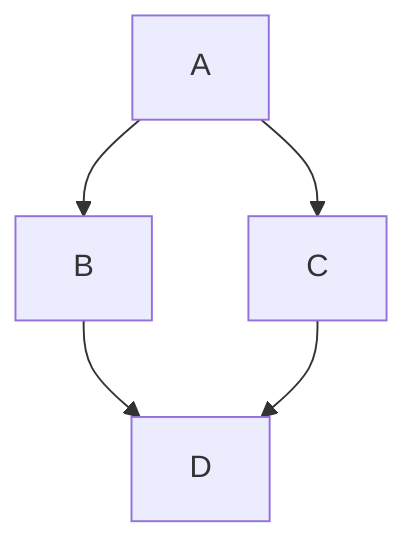

::: info
与 `Hexo` 不同，`Valaxy` 在框架层面实现了一些 Markdown 扩展（如 Container、数学公式）等，而无需主题开发者再次实现。

这与 `VitePress` 许多功能类似，`Valaxy` 从 `VitePress` 中借鉴了许多，并复用了 [mdit-vue](https://github.com/mdit-vue/mdit-vue) 的插件。
但也存在一些不同之处，Valaxy 默认使用 [KaTeX](https://katex.org/)（渲染速度快），同时也支持 [MathJax](https://www.mathjax.org/)（对齐 VitePress，SVG 输出无需外部 CSS/字体）。

> **注意**：`features.katex` 与 `math` 请勿同时开启，两者使用不同的渲染引擎，同时启用可能导致公式重复渲染或样式冲突。启用 `math`（MathJax）时，`features.katex` 会被自动忽略。

```ts [valaxy.config.ts]
export default defineValaxyConfig({
  // KaTeX（默认开启）
  features: { katex: true },

  // 或切换到 MathJax（需先安装：pnpm add markdown-it-mathjax3）
  // math: true,
})
```

当然，你仍然可以在 Valaxy 中通过添加 MarkdownIt 插件来实现更多功能。
:::

## 在 Markdown 中使用 Vue {#using-vue-in-markdown}

可以直接在 Markdown 文件中导入和使用 Vue 组件。

例如在 `components` 目录下创建一个 Vue 组件 `CustomVueDemo.vue`：

<<< @/components/CustomVueDemo.vue [components/CustomVueDemo.vue]

```md [pages/posts/xxx.md]
---
title: 在 Markdown 中使用 Vue
---

<!-- 在 markdown 中直接使用即可： -->
<CustomVueDemo />
```


## Emoji 表情支持 :tada: {#emoji-tada}


**输入**

```md
:tada: :100:
```


**输出**

:tada: :100:

这是一个我们所 [支持的 Emoji 列表](https://github.com/markdown-it/markdown-it-emoji/blob/master/lib/data/full.mjs) 。


## 目录 {#table-of-contents}


**输入**

```md
[[toc]]
```


**输出**

[[toc]]


可以使用 `markdown.toc` 选项配置 TOC 的渲染。


## 代码行高亮 {#line-of-code-highlighting}


````md
```js{4}
export default {
  data () {
    return {
      msg: 'Highlighted!'
    }
  }
}
```
````


**输出**

```js{4}
export default {
  data () {
    return {
      msg: 'Highlighted!'
    }
  }
}
```


**输入**

````md
```ts {1}
// line-numbers is disabled by default
const line2 = 'This is line 2'
const line3 = 'This is line 3'
```

```ts:line-numbers {1}
// line-numbers is enabled
const line2 = 'This is line 2'
const line3 = 'This is line 3'
```

```ts:line-numbers=2 {1}
// line-numbers is enabled and start from 2
const line3 = 'This is line 3'
const line4 = 'This is line 4'
```
````


**输出**

```ts {1}
// line-numbers is disabled by default
const line2 = 'This is line 2'
const line3 = 'This is line 3'
```

```ts:line-numbers {1}
// line-numbers is enabled
const line2 = 'This is line 2'
const line3 = 'This is line 3'
```

```ts:line-numbers=2 {1}
// line-numbers is enabled and start from 2
const line3 = 'This is line 3'
const line4 = 'This is line 4'
````


## 代码块的增减色块标识 {#colored-diffs-in-code-blocks}


在一行上添加 `// [!code --]` 或者 `// [!code ++]` 注释将创建该行代码的增减标识，同时保持代码块的颜色。


**输入**

请注意，在 `!code`后面只需要一个空格，这里有两个空格以防被渲染。


````md
```js
export default {
  data () {
    return {
      msg: 'Removed' // [!!code --]
      msg: 'Added' // [!!code ++]
    }
  }
}
```
````


**输出**

```js
export default {
  data() {
    return {
      msg: 'Removed', // [!code --]
      msg: 'Added', // [!code ++]
    }
  }
}
```


## 代码块中的错误和警告 {#errors-and-warnings-in-code-blocks}


在一行代码后中添加 `// [!code warning]` 或者 `// [!code error]` 注释将会使改行代码呈现指定颜色块。


**输入**


请注意，在 `!code`后面只需要一个空格，这里有两个空格以防被渲染。

````md
```js
export default {
  data () {
    return {
      msg: 'Error', // [!!code error]
      msg: 'Warning' // [!!code warning]
    }
  }
}
```
````


**输出**

```js
export default {
  data() {
    return {
      msg: 'Error', // [!code error]
      msg: 'Warning' // [!code warning]
    }
  }
}
```


## 导入代码片段 {#import-code-snippets}


您可以通过以下语法从现有文件中导入代码片段：

```md
<<< @/filepath
```


它还支持 [行高亮](#line-of-code-highlighting):

```md
<<< @/filepath{highlightLines}
```


**输入**

```md
<<< @/snippets/snippet.js{2}
```


**代码文件**

<<< @/snippets/snippet.js


**输出**

<<< @/snippets/snippet.js

::: tip


`@` 的值与源根相对应。默认情况下是博客根目录，除非配置了 `srcDir` 。另外，你也可以从相对路径导入：

```md
<<< ../snippets/snippet.js
```

:::


您也可以使用 [VS Code region](https://code.visualstudio.com/docs/editor/codebasics#_folding) 只包含代码文件的相应部分。您可以在文件路径后的 `#` 后提供自定义区域名称：


**输入**

```md
<<< @/snippets/snippet-with-region.js#snippet{1}
```


**代码文件**

<<< @/snippets/snippet-with-region.js


**输出**

<<< @/snippets/snippet-with-region.js#snippet{1}


您也可以像这样在大括号（`{}`）内指定语言：

```md
<<< @/snippets/snippet.cs{c#}

<!-- with line highlighting: -->

<<< @/snippets/snippet.cs{1,2,4-6 c#}

<!-- with line numbers: -->

<<< @/snippets/snippet.cs{1,2,4-6 c#:line-numbers}
```


## 代码分组 {#code-groups}


您可以像这样对多个代码块进行分组：


**输入**

````md
::: code-group

```js [config.js]
/**
 * @type {import('valaxy').UserConfig}
 */
const config = {
  // ...
}

export default config
```

```ts [config.ts]
import type { UserConfig } from 'valaxy'

const config: UserConfig = {
  // ...
}

export default config
```

:::
````


**输出**

::: code-group

```js [config.js]
/**
 * @type {import('valaxy').UserConfig}
 */
const config = {
  // ...
}

export default config
```

```ts [config.ts]
import type { UserConfig } from 'valaxy'

const config: UserConfig = {
  // ...
}

export default config
```

:::


你也可以在代码组中 [导入代码片段](#import-code-snippets) 。


**输入**

```md
::: code-group

<!-- filename is used as title by default -->

<<< @/snippets/snippet.js

<!-- you can provide a custom one too -->

<<< @/snippets/snippet-with-region.js#snippet{1,2 ts:line-numbers} [snippet with region]

:::
```


**输出**

::: code-group

<<< @/snippets/snippet.js

<<< @/snippets/snippet-with-region.js#snippet{1,2 ts:line-numbers} [snippet with region]

:::


## 容器 {#container}


通过对 `markdownIt` 进行配置，你可以自由设置自定义块区域的文字以及图标及图标的颜色。


::: tip

tip

:::

::: warning

warning

:::

::: danger

danger

:::

::: info

info

:::

```md
:::

::: tip

tip

:::

::: warning

warning

:::

::: danger

danger

:::

::: info

info

:::
```

::: details Click to expand

Details Content

:::

```md
::: details Click to expand

Details Content

:::
```


你也可以自定义新的容器名称。


```md
::: custom

I am a custom block.

:::
```

```ts [valaxy.config.ts]
import { defineValaxyConfig } from 'valaxy'

export default defineValaxyConfig({
  markdown: {
    blocks: {
      custom: {
        icon: 'i-ri:info-i',
        text: 'CUSTOM',
      },
    }
  }
})
```

## 添加代码块标题与图标 {#add-code-block-title-and-icons}


它基于 [vitepress-plugin-group-icons](https://github.com/yuyinws/vitepress-plugin-group-icons) 实现，内置了一些[常用图标](https://vp.yuy1n.io/features.html#built-in-icons)，你可以如下自定义更多图标。

```ts [valaxy.config.ts] {5-14}
import { defineValaxyConfig } from 'valaxy'
import { localIconLoader } from 'vitepress-plugin-group-icons'

export default defineValaxyConfig({
  groupIcons: {
    customIcon: {
      // valaxy: 'https://valaxy.site/favicon.svg',
      valaxy: localIconLoader(import.meta.url, './public/favicon.svg'),
      nodejs: 'vscode-icons:file-type-node',
      playwright: 'vscode-icons:file-type-playwright',
      typedoc: 'vscode-icons:file-type-typedoc',
      eslint: 'vscode-icons:file-type-eslint',
      dockerfile: 'vscode-icons:file-type-docker',
    },
  }
})
```

此时，使用以下语法：

````md
```ts [valaxy.config.ts]
import { defineValaxyConfig } from 'valaxy'

export default defineValaxyConfig({}) 
```
```dockerfile [sample.dockerfile]
FROM ubuntu

ENV PATH /opt/conda/bin:$PATH
```
````

我们将会得到带有 `valaxy.config.ts` 标题与 Valaxy 图标的代码块：

```ts [valaxy.config.ts]
import { defineValaxyConfig } from 'valaxy'

export default defineValaxyConfig({})
```

还会得到带有 `sample.dockerfile` 标题与 Docker 图标的代码块：

```dockerfile [sample.dockerfile]
FROM ubuntu

ENV PATH /opt/conda/bin:$PATH
```


## 数学公式 {#math-formulas}

::: tip


有关更多数学公式的信息可以在 [此处](/zh/examples/math) 找到。

:::


**输入**

```md
When $a \ne 0$, there are two solutions to $(ax^2 + bx + c = 0)$ and they are
$$ x = {-b \pm \sqrt{b^2-4ac} \over 2a} $$

**Maxwell's equations:**

| equation                                                                                                                                                                  | description                                                                            |
| ------------------------------------------------------------------------------------------------------------------------------------------------------------------------- | -------------------------------------------------------------------------------------- |
| $\nabla \cdot \vec{\mathbf{B}}  = 0$                                                                                                                                      | divergence of $\vec{\mathbf{B}}$ is zero                                               |
| $\nabla \times \vec{\mathbf{E}}\, +\, \frac1c\, \frac{\partial\vec{\mathbf{B}}}{\partial t}  = \vec{\mathbf{0}}$                                                          | curl of $\vec{\mathbf{E}}$ is proportional to the rate of change of $\vec{\mathbf{B}}$ |
| $\nabla \times \vec{\mathbf{B}} -\, \frac1c\, \frac{\partial\vec{\mathbf{E}}}{\partial t} = \frac{4\pi}{c}\vec{\mathbf{j}}    \nabla \cdot \vec{\mathbf{E}} = 4 \pi \rho$ | _wha?_                                                                                 |
```


**输出**

当 $a \ne 0$时，$(ax^2 + bx + c = 0)$ 有两个解，他们是
$$ x = {-b \pm \sqrt{b^2-4ac} \over 2a} $$

**麦克斯韦方程：**

| equation                                                                                                                                                                  | description                                                                            |
| ------------------------------------------------------------------------------------------------------------------------------------------------------------------------- | -------------------------------------------------------------------------------------- |
| $\nabla \cdot \vec{\mathbf{B}}  = 0$                                                                                                                                      | divergence of $\vec{\mathbf{B}}$ is zero                                               |
| $\nabla \times \vec{\mathbf{E}}\, +\, \frac1c\, \frac{\partial\vec{\mathbf{B}}}{\partial t}  = \vec{\mathbf{0}}$                                                          | curl of $\vec{\mathbf{E}}$ is proportional to the rate of change of $\vec{\mathbf{B}}$ |
| $\nabla \times \vec{\mathbf{B}} -\, \frac1c\, \frac{\partial\vec{\mathbf{E}}}{\partial t} = \frac{4\pi}{c}\vec{\mathbf{j}}    \nabla \cdot \vec{\mathbf{E}} = 4 \pi \rho$ | _wha?_                                                                                 |


### 自定义 KaTeX 选项 {#configuration}


> [KaTeX选项](https://katex.org/docs/options.html)

```ts [valaxy.config.ts]
export default defineValaxyConfig({
  markdown: {
    /**
     * KaTeX options
     * @see https://katex.org/docs/options.html
     */
    katex: {
      strict: false
    }
  }
})
```


## 包含 MarkDown 文件<!-- --> {#markdown-file-inclusion}

::: tip
You can also prefix the markdown path with `@`, it will act as the source root. By default, it's the Valaxy project root.
:::


**输入**

```md [your-file.md]
## Docs

<!--@include: @/TEST.md-->
<!--@include: ./parts/basics.md-->
```


**部分文件**

::: code-group

```md [parts/basics.md]
Some getting started stuff.

### Configuration

Can be created using `.foorc.json`.
```

```md [TEST.md]
I'm a TEST.
```

:::


**等效代码**

```md
## Docs

I'm a TEST.
Some getting started stuff.

### Configuration

Can be created using `.foorc.json`.
```


它还支持选择行范围：


**输入**

```md
## Docs

<!--@include: @/TEST.md-->
<!--@include: ./parts/basics.md{3,}-->
```


**部分文件**

::: code-group

```md [parts/basics.md]
Some getting started stuff.

### Configuration

Can be created using `.foorc.json`.
```

```md [TEST.md]
I'm a TEST.
```

:::


**等效代码**

```md
## Docs

I'm a TEST.
### Configuration

Can be created using `.foorc.json`.
```


所选行范围的格式可以是： `{3,}`, `{,10}`, `{1,10}`

::: warning


请注意，如果文件不存在，该功能不会出错。因此，在使用此功能时，请确保内容已按预期渲染。

:::

## UnoCSS


我们集成了 [UnoCSS](https://unocss.dev)，因此您可以在 Markdown 文件中直接使用它。


自由控制你的布局！

> 更多配置见 [UnoCSS Options | 配置](/zh/guide/config/unocss-options)。


<div class="flex flex-col">

<div class="flex grid-cols-3" gap="2">
  <div>

  
  </div>

  <div>

  
  </div>

  <div>

  
  </div>
</div>

<div class="flex grid-cols-2 justify-center items-center" gap="2">


</div>

</div>

```html [pages/posts/your-post.md]
<div class="flex flex-col">

<div class="flex grid-cols-3">
  <div>

  
  </div>

  <div>

  
  </div>

  <div>

  
  </div>
</div>

<div class="flex grid-cols-2 justify-center items-center">


</div>

</div>
```

## Mermaid

Based on [mermaid](https://mermaid.js.org/), you can use it in your markdown file directly.



````txt

````

More examples see: [Mermaid](/zh/examples/mermaid)

## 脚注


你可以使用 `[^1]` 或 `[^footnote]` 来添加脚注，例如：

```md
这是一个脚注[^1-zh]。

这是一段脚注[^2-zh]。

[^1-zh]: 这是一个脚注。

[^2-zh]: 这是一段脚注。

  正确缩进的脚注段落会被自动附加。

使用 `^[content]` 可以创建方便的内联脚注^[比如这个！]。
```

这是一个脚注[^1-zh]。

这是一段脚注[^2-zh]。

[^1-zh]: 这是一个脚注。

[^2-zh]: 这是一段脚注。

  正确缩进的脚注段落会被自动附加。

使用 `^[content]` 可以创建方便的内联脚注^[比如这个！]。


### 脚注预览


借助 [`Floating Vue`](https://floating-vue.starpad.dev/), 添加的脚注链接在鼠标悬停时会显示脚注内容。你可以在本页面的脚注链接上试一试！

如果你想要自定义脚注的样式，可以参考 [Floating Vue 文档](https://floating-vue.starpad.dev/guide/config) 中的 `config` 设置 `site.config.ts` 中的 `floatingVue`，你也可以修改组件 `ValaxyFootnoteTooltip` 来达到这一点。


## 自定义


### 自定义 Markdown 容器 Class


你可以在 Markdown 文件的 frontmatter 中添加 `markdownClass` 来自定义 Markdown 容器的 Class。


```md
---
markdownClass: 'markdown-body custom-markdown-class'
---
```

