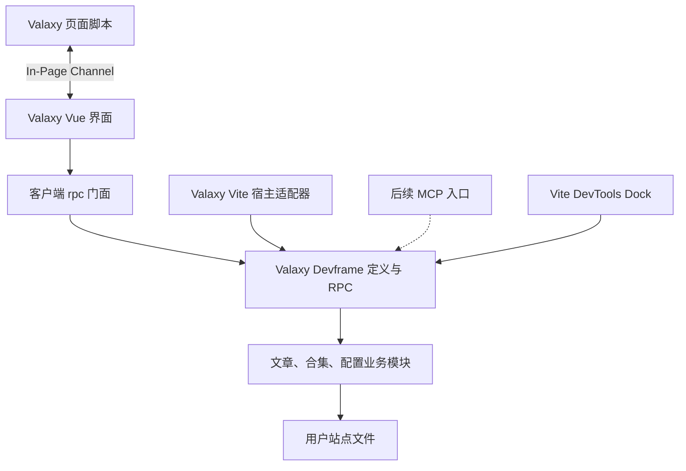

# Valaxy DevTools 的 Devframe 重构计划

调研日期：2026-09-17。代码基线：`fd242b5b`，`@valaxyjs/devtools@1.0.0-rc.11`。

状态：已按后续决定实施 Vite 8.3 升级与 Vite DevTools 接入。本文件保留最初调研和阶段划分；下面的“原始现状”描述迁移前代码，实际交付见末尾。使用 Vite DevTools 自带的 Hub，不新增 Valaxy 专属 Hub，MCP 保持关闭。

**建议采用 Devframe，以现有功能完整迁移为首个里程碑。保留 Vue 界面和 `@valaxyjs/devtools` 包，将业务操作、通信和宿主集成分开；优先验证 Vite DevTools 作为统一入口，同时保留独立页面能力。MCP 与自建 Hub 分别评估。**

迁移的主要收益是统一接口、解除对 Vue DevTools 窗口结构的依赖，以及让相同业务能力以后供 UI 和 Agent 使用。若目的仅是调整视觉样式，迁移的收益不足以抵消新增的连接与认证生命周期。

## 原始现状与切入点

| 位置 | 已确认的实现 | 对计划的影响 |
| --- | --- | --- |
| `src/node/functions.ts` | 10 个方法集中处理文章、合集、配置和 frontmatter；`ViteDevServer` 参数未实际使用 | 可先抽出不依赖 Vite 的业务模块 |
| `src/node/api/index.ts`、`src/client/rpc.ts` | 手写 Connect REST 路由与 fetch 映射；`rpc` 只是客户端门面 | 保持客户端调用方式，逐步替换内部实现 |
| `src/client/pages/` | 概览、文章、标签、分类、归档、合集、批量编辑、配置、设置共 9 个页面 | 全部纳入功能回归，继续使用现有 Vue/Reka UI/UnoCSS |
| `src/client/utils/get.ts`、`init.ts`、`api.ts` | 依赖 `window.parent.parent`、`__VUE_DEVTOOLS_ROUTER__`、`__VUE_INSPECTOR__` | 需要明确的页面通信协议和编辑器入口 |
| `packages/valaxy/node/server.ts` | `devtools` 开关动态加载 Vue DevTools 与 Valaxy DevTools | 保持布尔开关和按需加载行为 |
| `packages/valaxy/client/modules/devtools.ts` | 通过 Vue DevTools 的自定义 iframe Tab 提供入口，URL 写死在根路径 | 首期保留入口并修正 base 拼接；后续增加其他宿主 |
| `src/client/vite.config.ts` | 独立开发使用 5001 端口，还存在 `/trpc/` 代理与调试插件 | 重建明确的前端开发接线，验收 UI 热更新 |
| `build.config.ts`、`rpc.d.ts` | 构建 externals 从 Valaxy 包读取；RPC 类型引用客户端类型 | 让发布包自己声明依赖，并验证导出类型可独立解析 |
| `test/collections.test.ts` | 部分逻辑由测试重新实现，而非调用真实业务模块 | 用临时目录测试真实接口，避免测试与实现一起漂移 |

以下是源码检查发现的问题，需要在迁移前后用测试确认并修复：

- `getPageData()` 将文件路径直接交给 `matter()`，没有读取 Markdown 内容；路径参数与路由路径的含义也需统一。
- `runMigration()` 直接接收文件路径；它与单篇、批量编辑没有共用文件范围和字段检查。
- `initDevtoolsClient()` 有未对 router 本身判空的 `afterEach` 访问，独立打开缺少可靠的降级路径。
- REST 地址、iframe 地址与静态资源挂载的 base 处理不同，子路径部署需要一并验证。
- 当前配置编辑读取的是源文件的可序列化表示，并非 Valaxy 最终合并配置；合集解析也只支持部分 TS 写法。首期保留并说明这些语义，不把它们宣传为完整运行时检查器。

## Devframe 选型结论

迁移前 Valaxy 嵌入的是 **Vue DevTools**（`vite-plugin-vue-devtools` 与 `@vue/devtools-api`），不是新的 **Vite DevTools**（`@vitejs/devtools`）。Vite 插件是安装 Vue DevTools 的方式，不代表它属于 Vite DevTools。

“首期不引入 Hub”更准确地说是：**首期不自行搭建并维护 Valaxy 专属的通用工具宿主**。使用 Vite DevTools 时，可以直接复用其 Hub、Dock 和命令系统；这与保持 Valaxy 的 Devframe 定义独立并不冲突。[DevTools Kit 的职责](https://devtools.vite.dev/kit/)

2026-09-17 的官方 Vite DevTools 接入文档要求 Vite 8.3+，而本仓库 catalog 为 `^8.1.3`、锁文件解析为 8.1.3。P0 要先验证 Vite 升级与 SSG/插件链兼容性；通过后，建议首期包含 Vite DevTools Dock 接入。未通过时，首期继续使用标准 handler 与现有 Vue DevTools 入口。后续用户已确认升级；本轮将 catalog 与锁文件升级到 Vite 8.3.0，并采用原生 `devtools` 配置。[Vite DevTools 安装要求](https://devtools.vite.dev/guide/)

核对时官网与 npm 的 Devframe 版本均为 `1.0.0`；npm 查询到 `@vitejs/devtools-kit@0.7.5`、`@devframes/vite@1.0.0`。实际实施应在 workspace catalog 中固定经 PoC 验证的版本，并提交锁文件。仓库当前 `package.json` 的 Node 要求是 `>=22.12.0`，验证以此为准。

| 选项 | 适用场景 | 本计划决策 |
| --- | --- | --- |
| `devframe/initiate` 的 `initDevframe()` | 在现有 Vite 服务挂载一个 Devframe | 提供无 Vite DevTools 宿主时的运行方式；复用 Vite HTTP server 承载 WebSocket |
| `@vitejs/devtools-kit/node` 的 `createPluginFromDevframe()` | 让 Vite DevTools 宿主发现并安装工具 | 提前到 P0 验证，通过后作为推荐集成入口；不能把它当成普通 Vite 自动启动服务器的插件 |
| `@devframes/vite/single` | 开发 Devframe 自身的 SPA 或接入其服务 | PoC 中评估是否简化现有 5001 开发流程，按需要采用 |
| `@devframes/hub` 与 Hub UI | 组合多个独立工具 | 有第二个真实工具接入需求时再引入 |

标准 handler 支持 Connect middleware、共享宿主 HTTP server，以及显式关闭实例，适合当前架构。[官方标准 handler 文档](https://devfra.me/adapters/initiate)

`createPluginFromDevframe()` 返回供 Vite DevTools 扫描的集成定义，需要相应宿主。`@devframes/vite` 还区分 `/single` 与 `/hub`，不能混用这些接入方式。[Vite DevTools 适配器](https://devfra.me/adapters/vite)、[Vite 集成说明](https://devfra.me/frameworks/vite)

官网首页的简化示例与详细定义页存在写法差异。实现时以固定版本的导出类型为准，使用完整 metadata、`importMetaUrl` 和经验证的 `clientAssets` 配置，不照搬首页的 `view` 示例。[Devframe 定义](https://devfra.me/guide/devframe-definition)

## 目标架构



建议仍放在一个包内，先形成清晰接口，不新增独立 npm 包：

```text
packages/devtools/src/
  node/functions.ts     # 不依赖 Vite 的文章、合集、配置操作
  node/utils/           # 路径校验及文件转换
  shared/               # DTO、输入 schema、页面通信协议
  node/
    definition.ts       # createValaxyDevframe(options)
    rpc/                # 从业务能力定义 query/action
    vite.ts             # 现有 Vite 插件导出的实现
  client/
    rpc.ts              # 连接、类型化调用、错误适配
    bridge.ts           # 页面通信的 panel 端
    ...                 # 保留现有页面与组件
```

`node/functions.ts` 与 `node/utils` 封装文件读取、写入和转换；它不接收 Vite server 或 Devframe context。生产实现使用真实文件系统，测试通过临时站点目录调用同一接口。避免为每个 fs 方法再建立一层抽象。

`definition.ts` 通过显式 `userRoot` 创建业务模块，不依赖进程 cwd 猜测用户站点。`ValaxyDevtools(options)` 默认导出继续可用，`options.userRoot`、`options.base` 和包根的 safelist 导出保持兼容。额外的 Devframe 定义入口在 exports 中明确声明。

浏览器 DTO 与运行时 schema 放在共享目录；不得让浏览器导入 Node 实现。仅用于类型的 Valaxy 引用可保留，运行时不形成 `valaxy → devtools → valaxy` 循环。DevTools 内现有跨包工具引用另行核对，不为本次迁移搬动整个框架类型体系。

## 能力迁移表

使用 `valaxy` scope；定义中使用裸名称，线上名称形如 `valaxy:get-post-list`。RPC 类型与参数校验从定义推导，保留旧 `ServerFunctions` 类型别名作为兼容入口，避免维护两份独立契约。[RPC 定义与类型推导](https://devfra.me/guide/rpc)

| 当前方法 | 建议 RPC 名称 | 类型 | 首期行为 |
| --- | --- | --- | --- |
| `getOptions` | `get-options` | query | 返回站点根、实际站点 URL/base 和宿主能力 |
| `getPostList` | `get-post-list` | query | 保留排序和 frontmatter 展示 |
| `getPageData` | `get-page-data` | query | 明确站点相对文件路径，读取真实内容 |
| `getCollectionList` | `get-collection-list` | query | 保留配置顺序与纯链接条目 |
| `getConfig` | `get-config` | query | 保留源配置读取语义 |
| `createPost` | `create-post` | action | 保留标题生成文件名、重名处理和草稿默认值 |
| `updateFrontmatter` | `update-frontmatter` | action | 保留单篇编辑和正文内容 |
| `batchUpdateFrontmatter` | `batch-update-frontmatter` | action | 保留 set/delete/rename 与逐文件结果 |
| `updateConfigField` | `update-config-field` | action | 保留 Magicast AST 编辑与配置缺失时创建 |
| `runMigration` | `run-migration` | action | 兼容旧名称，复用经过校验的迁移实现 |

`getPageData` 和 `runMigration` 当前没有查到 UI 调用，但已出现在导出契约中，不能仅因页面未调用就删除。

新增输入 schema 使用一种 Standard Schema 实现，建议 PoC 评估 Valibot；支持 frontmatter 自定义字段，不用过严的固定字段对象破坏扩展。显式定义日期等值的序列化规则，避免 REST 的 JSON 字符串变成 RPC 的 Date 后影响表单与排序。

统一服务端错误分类，例如无效输入、文件不存在、写入冲突、配置表达式不支持；客户端门面暂时映射回现有 `success/error` 和批量结果结构。业务模块统一验证写入位置与字段，不依赖 UI 限制。

## 页面联动与数据刷新

页面上下文通过 `devframe/in-page-channel` 传递序列化的 `routePath`、`filePath`、frontmatter 与连接状态。页面脚本直接接收 Valaxy 的 router 与页面数据，不再从 Vue DevTools 私有全局变量取值。该协议支持通过祖先窗口或 opener 建连及重新握手。[In-Page Channel](https://devfra.me/guide/in-page-channel)

- iframe 模式：页面切换后更新当前文章高亮与上下文。
- 从站点打开的新窗口：存在同源 opener 时尝试建连。
- 地址栏直接打开 DevTools：文件管理照常工作，当前页面上下文显示未连接；不假定能找到任意已有标签页。
- 一个站点的不同标签页保持各自上下文；用户在 DevTools 中选择编辑的文章与站点当前路由分开保存。
- router hook、MessageChannel、RPC 订阅都在卸载或 HMR 时释放。

“在编辑器打开”走经验证的服务端 action，限制在项目允许的文件/目录范围，复用公共 editor helper；在可选 Vite DevTools 宿主下，可由宿主适配器提供该能力。移除 `__VUE_INSPECTOR__` 依赖。

文件变化继续使用 Vite watcher。首期通过 debounce 后的资源版本号/失效通知重新查询文章、合集和配置，不全量同步正文。断线重连后重新查询当前数据，避免丢失期间的更新；尚未保存的表单保留本地副本并显示外部修改提示。

服务端共享状态只保存必要的同步信息；UI 的筛选、密度和草稿继续放在本地 Vue 状态。共享状态的重连快照能力可用于资源版本通知。[Shared State](https://devfra.me/guide/shared-state)

## 分阶段交付

以下为一名熟悉仓库的维护者的粗估，PoC 完成后重估。每阶段均有可独立评审的结果。

| 阶段 | 工作 | 验收条件 | 估时 |
| --- | --- | --- | --- |
| P0 可行性原型 | 临时 fixture 中使用 Devframe 1.0.0 挂载一个只读查询与最小 Vue 页面，验证打包、认证、同端口 WS 和子路径；另验证 Vite 8.3+ 与 Vite DevTools Dock | `/` 与 `/blog/` 可连接；Vite HMR 正常；关闭无残留 socket；确认 Vite 升级对 SSG/插件链的影响，决定首期默认宿主 | 0.5–1 天，升级问题另估 |
| P1 业务接口整理 | 从 `getFunctions(server, options)` 抽出 core/shared，旧 REST 暂时调用新 core；补真实文件测试 | 10 项能力覆盖；合集顺序、日期、正文、配置表达式行为明确；修复路径与页面读取问题 | 1–2 天 |
| P2 通信迁移 | 完整 Devframe 定义、query/action schema、客户端门面、认证/断线 UI；一次切换服务端与前端接线 | 9 个页面均能加载和操作；保存后可刷新；不再注册旧 REST 路由；原入口可用 | 2–3 天 |
| P3 页面桥接与刷新 | In-Page Channel、编辑器 action、文件失效通知、base/站点 URL 来源统一 | iframe 与独立页面均正常；页面路由联动、多标签页隔离、外部文件修改及配置触发重启可恢复 | 1.5–2 天 |
| P4 发布验收与清理 | 独立包消费测试、DevTools E2E、文档、依赖清理、发布候选版本验证 | 功能矩阵通过；devtools 关闭和生产构建无工具资源/连接；包类型与资源路径在干净项目可用 | 1–2 天 |

首个完整迁移里程碑预计 **6–10 个工作日**，不含评审等待、MCP、自建 Hub、新 UI 或复杂站点兼容性追加工作。Vite 版本升级及 Dock 集成的追加工作量由 P0 单独评估。

P0 的继续条件：固定版本能使用公共接口完成共享端口、认证、资源定位与 Vue 前端开发，不需要访问 `_rpcGroup` 或 `devframe/internal`。若不成立，应先解决或上报最小复现，重新评估接入方式，避免把私有接线带入 Valaxy。

P2 必须处理 Devframe 默认启用的首次连接认证。使用标准连接与 OTP/授权链接机制，提供明确的未连接、待认证、已连接、重连状态；开发、iframe 与独立页面共用同一流程。首期显式关闭 MCP，避免可选依赖或元数据变化意外开启额外入口。[客户端连接与认证](https://devfra.me/guide/client)

## 测试与发布门槛

| 层次 | 必测场景 |
| --- | --- |
| 业务接口 | 10 个方法调用真实临时文件；批量部分失败、重名文章、中文标题、自定义字段、合集链接顺序、正文保留 |
| 写入约束 | 相对/绝对路径语义、`..` 越界、符号链接越界、非 Markdown 文件、危险字段；迁移入口与其他写入口规则一致 |
| 配置编辑 | 缺失配置创建、嵌套字段、themeConfig、函数/引用表达式；无法安全编辑时返回明确错误而不覆盖原文件 |
| 传输与生命周期 | 未认证请求被拒、错误输入在写入前失败、WS 与 HMR 共存、重连重新查询、重启和卸载无重复监听 |
| 界面 | 9 个页面、创建文章、单篇/批量编辑、配置保存、编辑器打开、主题/语言、设置持久化、当前页面联动 |
| 环境 | base `/` 和 `/blog/`、实际端口变化、5001 UI 开发模式、独立打开、iframe；按项目支持范围验证 HTTPS/反向代理 |
| 包与构建 | pnpm 干净消费环境、默认导出/新增子路径/旧类型入口、`clientAssets` 路径、SSG、`devtools: false` |

新增 `test/devtools/*.test.ts`，直接调用 core 和 RPC 注册接口；将复制算法的测试替换为真实实现测试。新增专用 DevTools Playwright 配置，启动临时站点并使用独立端口，不在 `demo/yun` 或 docs 的真实文章上执行写入测试。

实施时运行：

```bash
pnpm exec vitest run test/devtools test/collections.test.ts
pnpm run typecheck
pnpm run lint
pnpm run build
# 以下配置由 P4 新增
pnpm exec playwright test --config playwright.devtools.config.ts
pnpm run demo:build
pnpm run docs:build
```

P4 还要将打包产物安装到临时消费项目，验证 pnpm 严格依赖解析与类型导出。当前 `build.config.ts` 从 Valaxy 读取 externals，必须改为以 DevTools 自身依赖为准，并核对 `consola`、`dayjs`、`fast-glob`、`gray-matter` 等实际运行时 import。是否删除 `axios`、`body-parser`、`cors`、代理库和 `sirv`，以迁移后包内引用为准；不连带删除其他 workspace 仍使用的 catalog 项。

保留 `devtools: boolean` 的用户配置。迁移过程中 P1 仍由旧 REST 提供服务；P2 同时切换前后端，关闭旧 REST 注册，避免维护两套活动协议。候选版本验证失败时回退完整提交或配套的上一版 Valaxy/DevTools 包，不静默切回无认证的旧写入路由。清理代码随同候选版本验收进行，不保留长期双实现。

## 后续增量

### MCP：迁移完成后的第一项扩展

安装匹配版本的可选 `@devframes/agentic`，由宿主显式启用 MCP；复用 Devframe RPC 定义，按函数选择是否提供 `agent` 元数据。HTTP MCP 与 UI WebSocket 的认证机制分别验证，不假定完成浏览器 OTP 就保护了 MCP 路由。[MCP 适配器](https://devfra.me/adapters/mcp)

首个 MCP 版本建议提供文章检索/详情、合集和配置摘要等读取能力，补分页、字段选择和配置摘要过滤，避免将整个配置文件或所有文章一次发给 Agent。`get-config` 的 UI 完整结果不能直接等同于可公开给 Agent 的摘要。还需显式筛选 shared state 资源；Devframe 的 Agent 能力包含共享状态资源，不能只检查 RPC 上的 `agent` 字段。[Agent 能力说明](https://devfra.me/guide/agent-native)

写入工具在后续加入：复用同一业务模块，增加预览结果、文件版本校验及明确的逐文件执行结果。普通文件 RPC 不自动提供正在浏览的页面上下文；如 Agent 需要页面状态，应另行设计浏览器连接与标签页选择。

### Vite DevTools 集成与自建 Hub 分开决策

P0 提前验证基于 `createPluginFromDevframe()` 的接入入口，通过后将 Dock 集成纳入首期：Valaxy 保留自己的文章/配置界面，由 Vite DevTools 提供外层工具入口。独立打开复用同一套界面与业务定义，不发展第二套产品。

未安装该宿主时，Valaxy Vite 插件仍可运行。两种运行方式需要明确选择，同一进程不同时安装重复的 Valaxy Devframe 实例或注册冲突路径。直接打开页面与内嵌页面的可用能力需分别验收。

Vue DevTools 的组件树等现有调试能力单独验证，不能因为接入 Vite DevTools 就假定它们被自动替代；旧 Tab 的移除与 Vue 调试插件的保留是不同决策。

当需要同时组合 Valaxy、路由/Markdown 诊断、主题或 addon 工具时，再评估 Hub 与公共扩展接口。仅把 9 个页面各拆成一个 Devframe 没有足够收益；Hub 应负责多个独立工具的组织。Hub 本身不提供 UI，需要选择现成或自建 UI。[Hub 文档](https://devfra.me/guide/hub)

静态诊断报告、Markdown 编译链检查、配置来源追踪、addon 开发工具属于后续产品能力。可以沿用这个架构，但不计入本次功能等价迁移。

## 本轮交付

本轮按用户确认的方向合并推进基础升级与通信迁移：

- catalog 使用 Vite 8.3.0、Devframe 1.0.0、Vite DevTools/Kit 0.7.5。
- `ValaxyDevtools()` 保留默认导出，优先由 Vite DevTools 安装；无宿主时通过 `initDevframe()` 提供同一页面与 RPC。
- 新增 `@valaxyjs/devtools/definition`、`@valaxyjs/devtools/page`，保留 `/rpc` 类型入口。10 个原操作及编辑器入口迁移到经过 schema 校验的 RPC，移除旧 REST 与私有 Vue DevTools 全局变量。
- 保留 Vue DevTools 调试能力；Valaxy 面板迁至 Vite Dock。页面桥接独立管理当前浏览路由。
- 提供验证码认证、断线重连 UI、资源失效通知，以及单篇编辑的本地草稿和外部修改提示。日期编辑同步到实际保存数据。
- `test/devtools/rpc.test.ts` 使用真实临时目录、公开 RPC 注册接口和 Vite watcher；不改写 demo/docs 的用户文章。

已完成的验证：

- 全量 Vitest：45 个测试文件、389 项测试通过；类型检查、全库 ESLint、核心包构建通过。
- demo/yun 与 docs 的 SSG 构建通过；demo 产物未发现 Devframe、页面桥接或 DevTools 嵌入代码。
- Chromium 1440×1000：首次认证、错误验证码、9 个页面、文章保存、外部修改刷新、未保存草稿保留与重新读取、Dock 页面联动、服务器重启后恢复。
- 根路径与 `/blog/` 的 Vite Dock，以及 `/blog/` 的独立模式通过；`pnpm devtools` 的 5001 开发页面可连接，Vue HMR 保持当前页面。
- 将实际 tarball 安装至仓库外的 pnpm 消费项目：默认导出、definition/page/rpc 子路径在 NodeNext 下通过类型检查；静态资源定位与独立 RPC 端点可运行。

Playwright 验证脚本、截图与临时站点保留在系统临时目录，不纳入源码。此次没有执行编辑器实际启动、HTTPS/反向代理、移动设备真机及多浏览器矩阵，也未将该浏览器矩阵接入 CI。复杂配置表达式解析、写入版本冲突检测、MCP、自建 Hub 仍属于后续工作。后续 issue 可基于本文件拆分增量任务；本轮未创建 issue。


## UI 对齐交付

按用户补充要求，Valaxy 面板采用 Devframe Hub UI 同源的 `@antfu/design@0.4.0`。Hub UI 的入口负责宿主装配，公共 Vue 组件与 UnoCSS 预设来自 `@antfu/design`；面板直接复用该公开设计层。

- DevTools 独立 UnoCSS 配置使用 `presetAnthonyDesign`、Wind4、语义颜色和命名层级。样式只进入 DevTools SPA。
- 直接复用 ActionButton、FormSelect、FormCheckbox、FormTextarea、FormSegmentedControl、OverlayModal、LayoutCard、FeedbackTip 和 FeedbackEmptyState。保留原生输入及部分 Reka 控件的数值、日期、datalist 行为，并统一其语义样式。
- 导航展示名称与图标；概览、标签、列表与表单统一间距、背景和选中反馈。概览文章链接正确定位编辑对象，并显示当前语言的标题。
- 使用 Hub 共用的 `devframes-color-scheme`；从公开连接配置读取品牌色，映射到主色色阶。`/blog/` 测试宿主的自定义品牌色通过实际文字计算色验证。
- 640px 以下列表与编辑区上下排列；长文件路径换行，操作栏支持换行，补充控件标签与键盘焦点。

验证：DevTools 完整构建、全局类型检查、DevTools ESLint、CSS/SCSS Stylelint、8 项 DevTools 单元测试通过。Chromium 验证桌面浅色/深色、390px 宽度的 9 个页面、选择器、弹窗与 Escape 关闭、Hub 与面板的主题同步；控制台无错误；5001 前端开发模式可认证、浏览和渲染同源控件。根路径和 `/blog/` 内嵌面板、`/blog/` 独立页面的认证、文章保存、外部修改、草稿保留、页面联动通过。浏览器写入验证使用临时站点，截图和脚本保留在系统临时目录。

## Addon 扩展与编辑器首期

按本轮确认的顺序实现：

1. 恢复语义配色：文章统计区分总数、已发布、草稿；分类/标签使用稳定的身份色，适配深浅色；选中态和焦点保持宿主品牌色。
2. 接入 addon：`ValaxyNodeAddon.devtools(context)` 懒加载插件，关闭 addon/DevTools 与生产构建均不执行该入口。`@valaxyjs/devtools/plugin` 导出 v1 声明类型和 `defineValaxyDevtoolsPlugin()`。
3. 独立面板：预构建 SPA 注册到 Vite DevTools 的 Valaxy Dock 分组；主界面的扩展页提供直接打开入口。主面板与 addon 采用同级 URL，避免 SPA fallback 覆盖子面板。独立模式复用同一套面板和认证连接。
4. 共享接口：Node setup 与浏览器 client-api 共享文章、页面 frontmatter、合集、源配置、站点选项和变化订阅。RPC 按 addon ID 分隔；当前浏览页面仍走本地页面桥接。关闭、重启、部分 setup 失败时释放订阅和 addon 清理函数。
5. 编辑器：声明式 text/textarea/boolean/number/select 字段与只读草稿检查。字段按 addon 分组、显式添加/移除、保存时写入；校验覆盖普通保存、批量编辑和迁移。重复字段、核心字段覆盖、危险键和无效 ID 在注册阶段报错。

`packages/devtools/examples/seo-addon` 提供完整示例，可在 demo 的 addons 配置中接入。它只演示接口；SEO 字段的发布渲染由主题负责。完整 API、生产隔离、路径和生命周期约定见包 README。

长期默认依托 Vite DevTools 宿主；Valaxy 保有业务和扩展层。此轮没有自建 Hub，也不承诺永远绑定某一个宿主。后续扩展方向包括正文编辑、组件插槽、字段迁移与能力协商；这些均未混入 v1 的首期范围。

### 本轮验证结果

- 全量 Vitest：46 个文件、395 项测试通过；最终修改涉及的 DevTools 14 项测试再次通过。修复 watcher 测试的初始扫描竞争，等待目录被监听后再创建测试文件。
- 全局类型检查、DevTools/接入代码/示例/文档 ESLint、DevTools 样式检查、`git diff --check` 通过。核心包完整构建与最终 DevTools 构建通过。
- Chromium：浅色/深色、390px 的 9 个主页面、选择器与弹窗键盘操作通过；验证了真实示例字段的添加/移除、小数值、布尔值、选择项、显式保存和草稿检查。修复了新增字段的 Vue 响应式更新与窄屏扩展按钮换行。
- 根路径和 `/blog/` 的内嵌模式通过文章保存、addon 面板同步、当前页面桥接；`/blog/` 验证了服务重启恢复。独立模式 `/blog/` 下的相同字段/独立面板/数据订阅验证通过。写入仅发生在临时站点。
- 实际 tarball 安装到仓库外的新 pnpm 项目；NodeNext 检查覆盖 addon loader、plugin 与 client-api 类型，Node 运行检查覆盖新的公开子路径。
- 外部依赖记录：较早的完整浏览器矩阵控制台无错误；末轮原生 Vite 宿主的 Iconify SVG 请求出现 CORS/ERR_FAILED（包含宿主自身图标），使“零控制台错误”断言失败。全部业务交互断言仍通过，独立模式无此错误。未修改或屏蔽宿主图标服务，后续可向上游反馈并评估本地图标回退。

截图、浏览器验证脚本及消费项目均位于工作区之外；没有提交测试认证信息。验证阶段未创建 GitHub issue；提交和推送记录见 Git 历史。

## 原生侧栏导航

- 分类、标签与文章、归档、合集等管理页放入 Vite DevTools 的 Valaxy 原生侧栏。移除面板顶部重复的一级 Tab，顶部保留品牌、当前页和通用操作；文章的发布状态等页内筛选继续留在内容区。
- 使用公开 `frameId: 'valaxy:main'` 与 `subTabs: { protocol: 'postmessage' }` 接口。页面共享一个 iframe，路由、侧栏选中态和翻译后的名称双向同步。按消息来源、origin、协议版本及已声明页面校验导航；取消导航时恢复宿主选中态。
- 内嵌面板通过公开 `devframe:docks` shared state 检测已注册的导航 anchor。移除对 URL 参数的依赖，修复 Hub 恢复旧面板地址时出现内外两层侧栏的问题。浏览器回归覆盖恢复无参数的旧 `#/config` 地址以及没有 Hub 的独立 iframe。
- 独立打开时复用 `@antfu/design` 的 `LayoutSideNav`，与宿主导航共用页面定义。窄屏改用导航弹窗；分类和标签仍是独立入口。内置导航图标随包分发，不依赖外部 Iconify 服务。
- Frontmatter 草稿按文件保存在当前会话内，切换管理页、文章和 addon 面板不会丢失。显式保存使用发起时的文件路径，避免异步保存期间切换文章后更新错误对象。刷新浏览器会清空未保存的内存草稿。
- 验证：19 项 DevTools 单元测试、全局类型检查和相关 ESLint 通过；Chromium 根路径与 `/blog/` 下验证原生侧栏、独立桌面/390px 导航、iframe 复用、草稿切换/保存、addon 共享数据、语言切换和父页刷新，控制台无错误。浏览器写入仅发生于临时站点。

## 合并页面调试

- 原生侧栏新增“页面调试”，使用同源卡片和语义配色展示站点视口、断点、路由、Frontmatter、站点配置摘要和主题运行时配置。Yun 主题移除默认的左下角 `ValaxyDebug` 浮窗；组件保留供已有主题显式使用。
- 延伸现有浏览器页面通道，给 `ClientPageData` 增加可选 `debug` 快照。`createValaxyPageBridge(router)` 仍兼容；Valaxy 客户端通过 `getDebug` 提供运行时信息。Vue effect scope 管理尺寸、媒体查询、配置监听和通道清理，仅在开发且 DevTools 开启时安装。
- 当前页面诊断与选中文章及未保存草稿分开保存；独立打开且无页面连接时显示空状态。当前页面不保存在服务端全局状态，多标签页互不覆盖；源配置编辑仍在原有“配置”页面。
- 验证：22 项 DevTools 测试、类型检查、ESLint 和 DevTools 构建通过。使用真实 Valaxy 客户端模块的 Chromium 临时站点验证根路径和 `/blog/`、1440px/390px、浅色/深色、路由与 Frontmatter 更新、运行时配置刷新、父页面视口、标签页隔离、草稿保留和卸载清理，控制台无错误。
- Yun 生产 SSG 构建通过，产物未包含页面调试通道、DevTools 地址或旧浮窗代码；真实 demo 预览确认旧浮窗消失，新页面显示当前站点数据。

## 代码高亮

- 在 Valaxy Devframe 的 `services` 中声明官方 `@devframes/service-shiki@1.0.0`，预加载 JSON，使用默认 Vitesse 深浅色主题。原生 Vite DevTools 与独立 Devframe 共用接入方式。
- 新增可复用的 `VDCodeBlock`，为页面调试的路由、Frontmatter、站点摘要和主题配置提供高亮。代码通过 RPC 交给本地开发服务器处理并缓存，浏览器不打包 Shiki 语法、主题或 WASM。
- 深浅色由 CSS 跟随现有主题切换；等待高亮、服务缺失或请求失败时展示当前纯文本。数据更新、断线重连和组件卸载会作废旧请求的结果，避免旧页面覆盖新页面。
- 验证：26 项 DevTools 单元测试、全局类型检查、相关 ESLint、Stylelint 与 DevTools 构建通过。Chromium 验证真实 RPC 高亮、HTML 字符转义、实时数据更新、深浅色颜色变化、390px 布局与多标签页隔离；覆盖原生根路径、`/blog/` 及独立 `/blog/`。

## 提交前收尾

- 将 Vite DevTools 自动安装的 Vite/Vitest 面板依赖纳入 workspace catalog；Vitest UI 与现有 Vitest 统一为 4.1.11，消除版本不匹配。
- 文件监听回归测试对临时目录使用轮询，避免原生文件事件批处理导致快速写入的偶发超时；生产监听配置保持原样。
- 最终全量 Vitest：49 个文件、407 项测试通过；全局类型检查、本轮改动的 ESLint/Stylelint、核心包完整构建与 `git diff --check` 通过。
