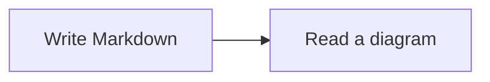

# valaxy-addon-mermaid

Official, opt-in Mermaid diagrams for Valaxy. Includes lazy client-side rendering, light/dark themes, and a keyboard-accessible zoom viewer. No pan/zoom library is required.

## Install

Requires **Valaxy 1.0.0-rc.16 or later**. Earlier Valaxy releases still include the old built-in Mermaid integration; upgrade Valaxy before enabling this addon.

```bash
pnpm add valaxy@latest valaxy-addon-mermaid
```

```ts
// valaxy.config.ts
import { defineValaxyConfig } from 'valaxy'
import { addonMermaid } from 'valaxy-addon-mermaid'

export default defineValaxyConfig({
  addons: [addonMermaid()],
})
```

Mermaid is a dependency of this addon; there is no separate Mermaid installation step. Installing the addon without enabling it does not activate diagram rendering.

## Write diagrams

````md

````

Existing fences, including options such as `mermaid {scale: 0.5, theme: 'forest'}`, remain supported. Quoted examples stay code examples. Feeds and excerpts preserve the diagram source as a code block.

## Options

```ts
addonMermaid({
  viewer: true,
  appearance: 'soft',
  config: {
    flowchart: { curve: 'basis' },
  },
})
```

| Option | Default | Description |
| --- | --- | --- |
| `viewer` | `true` | Click-to-expand dialog, wheel/pinch zoom, drag to pan, fit and original size. |
| `appearance` | `'default'` | Keep Mermaid's standard theme, or use `'soft'` for rounded nodes and a blue palette. |
| `config` | `{}` | Mermaid configuration; per-diagram options override it. An explicit `theme` takes precedence over automatic light/dark selection. |

In the viewer, use `+` / `-` to zoom, arrow keys to pan, `0` to fit, `1` for original size, and `Esc` to close. Diagram links remain interactive. SVG styles are isolated in Shadow DOM.

## Theme and mobile support

The viewer includes English and Simplified Chinese UI. Labels follow Valaxy’s active language (Chinese for `zh*`, English fallback for other locales), including toolbar controls, touch hints, loading/error messages and accessibility labels.

The card and viewer inherit the active theme’s surface, text, border and accent colors, including dark mode. Press uses compact rounded controls; Yun uses pill controls and its card radius. On phones the viewer fills the viewport, respects safe areas, and provides 44px touch targets, pinch zoom and drag gestures. Narrow toolbars keep Fit available as a labeled icon button.

You can override the viewer without changing Mermaid’s diagram configuration in `styles/index.scss`:

```css
:root {
  --va-mermaid-accent: var(--va-c-brand-1);
  --va-mermaid-radius: 12px;
}
```

Other optional variables: `--va-mermaid-bg`, `--va-mermaid-panel`, `--va-mermaid-text`, `--va-mermaid-muted`, `--va-mermaid-border`, `--va-mermaid-grid` and `--va-mermaid-button-radius`. Prefer theme variables for colors so overrides follow light/dark mode. These style the viewer shell; `appearance` and Mermaid `config` control the diagram itself.

## Migrating from built-in Mermaid

Install and enable this addon. Your Markdown does not need changes. Sites without Mermaid do not need the addon and no longer install the Mermaid dependency through Valaxy.

Without the addon, real Mermaid fences remain readable code blocks and Valaxy logs an installation/configuration notice once per build or dev configuration. Ordinary posts and fenced documentation examples do not trigger the notice. An existing `setup/mermaid.ts` also triggers the notice when the addon is disabled.

Existing theme and user `setup/mermaid.ts` files continue to work after enabling the addon. Prefer importing the helper and types from the addon:

```ts
// setup/mermaid.ts
import { defineMermaidSetup } from 'valaxy-addon-mermaid'

export default defineMermaidSetup(() => ({
  flowchart: { curve: 'linear' },
}))
```

The old `defineMermaidSetup` import from `valaxy` remains as a deprecated identity helper for migration. Import `MermaidOptions` and `MermaidSetup` types from `valaxy-addon-mermaid` instead. Precedence is: default theme → theme/user setup (user replaces theme) → addon `config` → per-diagram options.

Rendering is browser-only and lazy; importing addon configuration does not initialize Mermaid during SSR. Syntax failures are contained within the diagram and do not prevent other diagrams from rendering.
