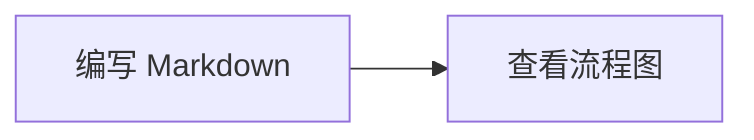

# valaxy-addon-mermaid

Valaxy 官方按需安装的 Mermaid 插件，提供客户端懒加载渲染、明暗主题和支持键盘操作的放大查看器，不依赖额外的缩放库。

## 安装与启用

要求 **Valaxy 1.0.0-rc.16 或更新版本**。更早版本仍内置旧 Mermaid 集成，请先升级 Valaxy 再启用本插件。

```bash
pnpm add valaxy@latest valaxy-addon-mermaid
```

```ts
// valaxy.config.ts
import { defineValaxyConfig } from 'valaxy'
import { addonMermaid } from 'valaxy-addon-mermaid'

export default defineValaxyConfig({
  addons: [addonMermaid()],
})
```

插件已声明 Mermaid 依赖，无需另行安装。仅安装但未在配置中启用，不会激活图表渲染。

## 编写图表

````md

````

旧文章语法保持兼容，包括 `mermaid {scale: 0.5, theme: 'forest'}` 等代码块选项。嵌套代码块中的教程示例保持为源码；RSS 和摘要保留可读的图表源码。

## 配置

```ts
addonMermaid({
  viewer: true,
  appearance: 'soft',
  config: {
    flowchart: { curve: 'basis' },
  },
})
```

| 选项 | 默认值 | 说明 |
| --- | --- | --- |
| `viewer` | `true` | 点击放大、滚轮或双指缩放、拖动平移、适应窗口和原始大小。 |
| `appearance` | `'default'` | 保留 Mermaid 默认风格；`'soft'` 使用圆角节点和蓝色主题。 |
| `config` | `{}` | Mermaid 配置，代码块内选项优先；显式指定 `theme` 后优先使用该主题。 |

查看器支持 `+` / `-` 缩放、方向键平移、`0` 适应窗口、`1` 原始大小、`Esc` 关闭。图内链接可正常交互，SVG 样式通过 Shadow DOM 隔离。

## 主题与移动端适配

查看器内置英文和简体中文文案，跟随 Valaxy 当前语言切换（`zh*` 使用中文，其他语言回退英文），覆盖工具栏、触摸提示、加载和错误提示及无障碍标签。

卡片与查看器自动继承当前主题的背景、文字、边框和强调色，并随亮暗模式切换。Press 使用紧凑圆角按钮，Yun 使用胶囊按钮和主题卡片圆角。手机上全屏预览，适配安全区，按钮触摸区域至少 44px，支持双指缩放和拖动；窄屏工具栏将“适应窗口”收为带无障碍名称的图标按钮。

可在 `styles/index.scss` 中覆盖查看器样式，无需修改 Mermaid 配置：

```css
:root {
  --va-mermaid-accent: var(--va-c-brand-1);
  --va-mermaid-radius: 12px;
}
```

其他可选变量：`--va-mermaid-bg`、`--va-mermaid-panel`、`--va-mermaid-text`、`--va-mermaid-muted`、`--va-mermaid-border`、`--va-mermaid-grid`、`--va-mermaid-button-radius`。颜色建议引用主题变量，以便跟随亮暗模式。这些变量控制查看器外观；图表本身由 `appearance` 和 Mermaid `config` 控制。

## 从内置 Mermaid 迁移

安装并启用插件即可，文章内容无需修改。不使用 Mermaid 的博客无需安装，Valaxy 核心也不再依赖 Mermaid。

未启用插件时，真实 Mermaid 代码块保留为可读源码，开发或构建会提示安装命令和启用方式，同一次配置下只提示一次。普通文章和嵌套代码块中的教程示例不会误触发。检测到旧 `setup/mermaid.ts` 且未启用插件时，也会提示迁移。

启用插件后，主题和站点现有的 `setup/mermaid.ts` 继续生效。建议将 helper 和类型的导入来源改为插件：

```ts
// setup/mermaid.ts
import { defineMermaidSetup } from 'valaxy-addon-mermaid'

export default defineMermaidSetup(() => ({
  flowchart: { curve: 'linear' },
}))
```

旧的 `import { defineMermaidSetup } from 'valaxy'` 暂时保留为已弃用的兼容函数；`MermaidOptions`、`MermaidSetup` 类型改从 `valaxy-addon-mermaid` 导入。配置优先级为：默认主题 → 主题/站点 setup（站点覆盖主题）→ addon `config` → 代码块选项。

Mermaid 只在浏览器中按需加载，SSR 不初始化渲染器。单张图的语法错误会在图内展示，不影响其他图表。
